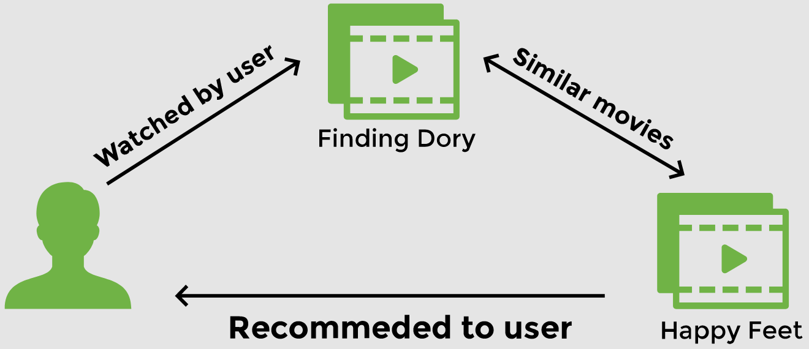
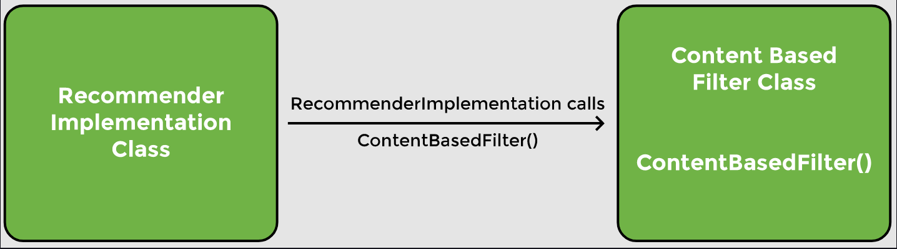

# Lesson 1: Dependency

## Overview

A recommender system is a system that filters some entities based on the user’s history. Recommender systems also rank these items based on user preferences. The system works by taking an input and then finding items similar to that input.

## Demonstrated Concepts

### Tight coupling

As can be seen, the `ContentBasedFilter` class is a dependency of the `RecommenderImplementation` class. The `RecommenderImplementation` class needs an object of `ContentBasedFilter` class to perform its task. This is an example of _tight coupling_.

If we want to use another filter in place of the content-based filter, we will need to change the code in the `RecommenderImplementation` class.

Consider a scenario, where we want to use one type of filter in one situation and another type of filter in another situation. Tight coupling makes this difficult to achieve.

In this lesson, we create two classes which work together, thus creating a dependency. In a typical enterprise application, there are a large number of objects which work together to provide some end result to the user. This results in a lot of dependencies. Spring is a dependency injection framework that makes the process of managing these dependencies easy.