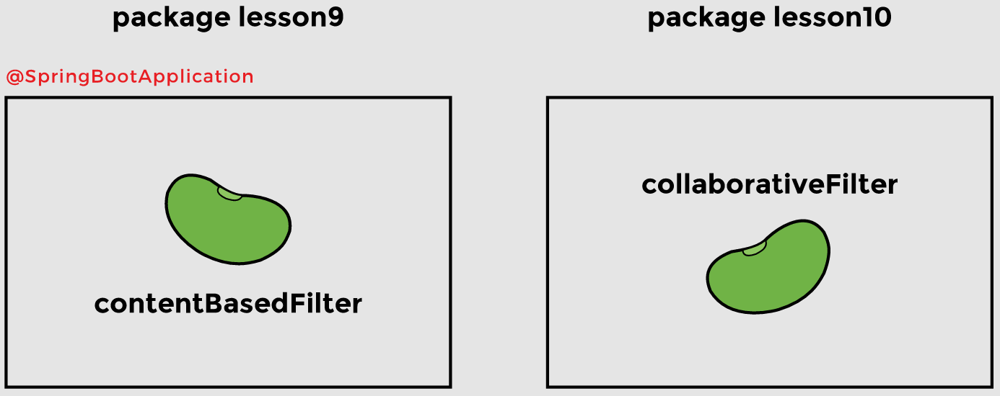
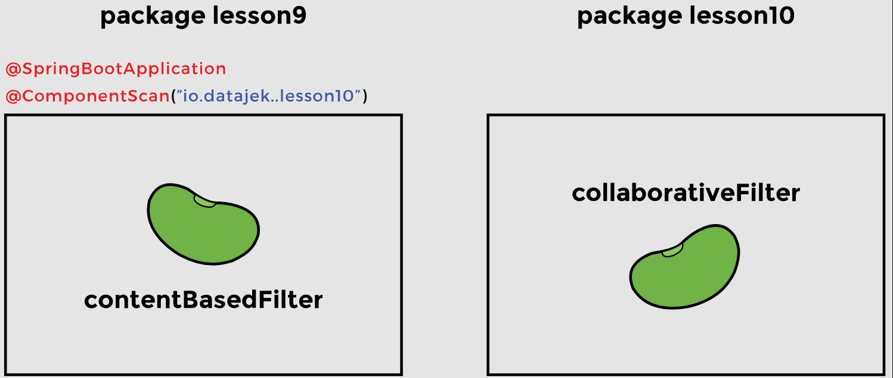
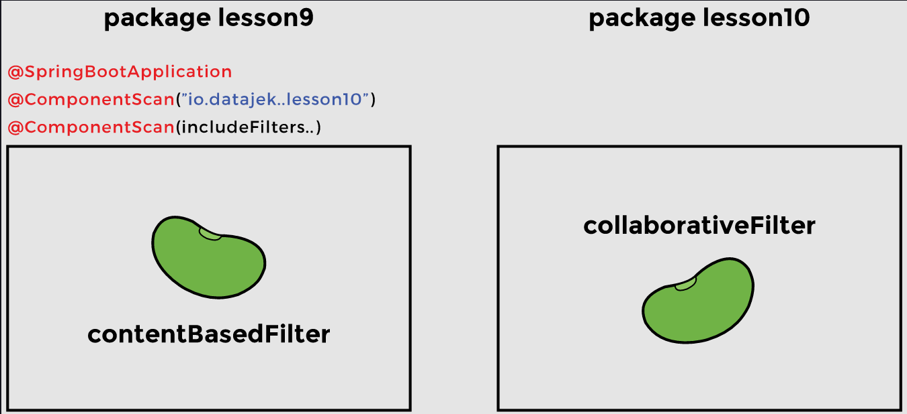

# Lesson 10: @ComponentScan

## Overview

Spring does a component scan to search for the beans that it manages.

## Demonstrated Concepts

### `@ComponentScan`

In a Spring application, the `@ComponentScan` annotation without any argument tells Spring to scan the current package as well as any sub-packages that might exist. Spring detects all classes marked with the `@Component`, `@Repository`, `@Service`, and `@Controller` annotations during component scan.

### `@SpringBootApplication`

In a Spring application, `@ComponentScan` is used along with the `@Configuration` annotation. In a Spring Boot application, component scan happens implicitly. The `@SpringBootApplication` annotation is a combination of three annotations:

- `@Configuration`
- `@EnableAutoConfiguration`
- `@ComponentScan`


`@SpringBootApplication` by default, searches the package where it is present, as well as all the sub-packages. If a bean is present in a package other than the base package or its sub-packages, it will not be found. If we want Spring to find beans defined in other packages, we need to use the `@ComponentScan` annotation and provide the path of the package where we want Spring to look for the beans.

To demonstrate that Spring cannot find beans in other packages, we will use the `MovieRecommenderSystemApplication` class in the lesson9 sub-package to access the `ContentBasedFilter` and `CollaborativeFilter` beans. The `ContentBasedFilter` bean is in the same package as the application file, but the `CollaborativeFilter` bean is present in a different package, namely: __io.datajek.springbasics.movierecommendersystem.lesson10__.



> The `MovieRecommenderSystemApplication` class has the `@SpringBootApplication` annotation which means that __io.datajek.springbasics.movierecommendersystem.lesson9__ and its sub-packages will be scanned for beans. The `containsBean` method, which returns a Boolean value, is used to check if the bean is found during component scanning.

```java
package io.datajek.springbasics.movierecommendersystem.lesson9;

@SpringBootApplication
public class MovieRecommenderSystemApplication {

    public static void main(String[] args) {
        ApplicationContext appContext = SpringApplication.run(
                                              MovieRecommenderSystemApplication.class, args);

        System.out.println("ContentBasedFilter bean found = " + 
                                              appContext.containsBean("contentBasedFilter"));
        System.out.println("CollaborativeFilter bean found = " + 
                                              appContext.containsBean("collaborativeFilter"));
    }
}
```

When the application is run, the `ContentBasedFilter` bean (from __lesson9__ package) is found but the `CollaborativeFilter` bean (from __lesson10__ package) is not found. This is because Spring scans the __io.datajek.springbasics.movierecommendersystem.lesson9__ package where the `@SpringBootApplication` annotation is used.

### `@ComponentScan` for specific package

We need to guide Spring to search the __io.datajek.springbasics.movierecommendersystem.lesson10__ package, where the `CollaborativeFilter` bean is present. The `basePackages` argument lists all the package names that are scanned during component scanning. We will use the `@ComponentScan` annotation with `basePackages` argument as follows:

```java
@ComponentScan(basePackages = "io.datajek.springbasics.movierecommendersystem.lesson10")
```

This time Spring detects the `CollaborativeFilter` bean but since we explicitly specified the package to be searched, it only looked for beans in that package only, and thus the `ContentBasedFilter` bean was not found.



If __lesson9__ package is included in the `basePackages` list, as shown below, both beans will be found.

```java
@ComponentScan(basePackages={"io.datajek.springbasics.movierecommendersystem.lesson9",
                             "io.datajek.springbasics.movierecommendersystem.lesson10"})
```

### Include and exclude filters

`@ComponentScan` can be used to include or exclude certain packages from being scanned. Include filters are used to include certain classes in component scan. Exclude filters are used to stop Spring from auto-detecting classes in component scan.

#### Filter types

There are different types of filters that make use of stereotype annotations, interfaces, regular expressions, and AspectJ expressions. Spring also allows the creation of custom filters. `FilterType` can have the following values:

- FilterType.ANNOTATION 
- FilterType.ASPECTJ 
- FilterType.ASSIGNABLE_TYPE 
- FilterType.REGEX 
- FilterType.CUSTOM

One way to direct Spring to detect both `ContentBasedFilter` and `CollaborativeFilter` beans, is to use the __include filter__ of type __REGEX__ and provide the path of the package where the `ContentBasedFilter` bean is present.

```java
@ComponentScan(basePackages = "io.datajek.springbasics.movierecommendersystem.lesson10")
@ComponentScan(includeFilters = @ComponentScan.Filter (
                    type= FilterType.REGEX, 
                    pattern="io.datajek.springbasics.movierecommendersystem.lesson9.*"))
```

Our REGEX pattern evaluates to all beans declared with `@Component` annotation in the lesson9 package. Now when the application is run, beans from two different packages are successfully detected.



Modify the annotations of the `MovieRecommenderSystemApplication` class in __lesson9__ package to run the application without `@ComponentScan` annotation and see the results. Then run with the `@ComponentScan` annotation providing the path to __lesson10__ package, and observe the results. Lastly, run `@ComponentScan` with the `includeFilters` to see how it affects the output.
