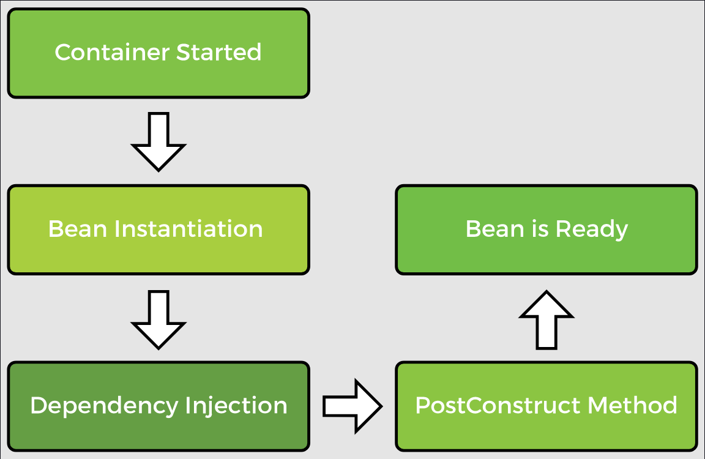
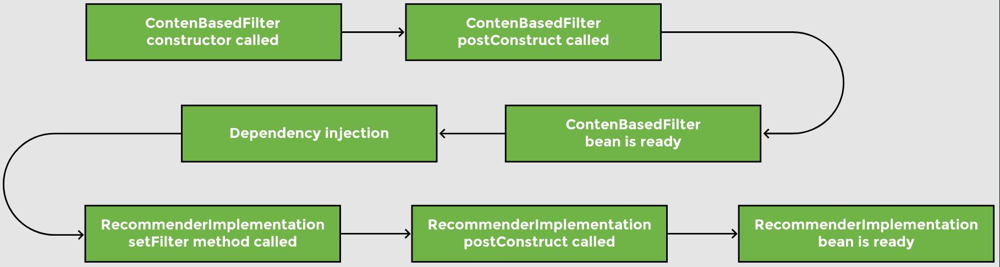
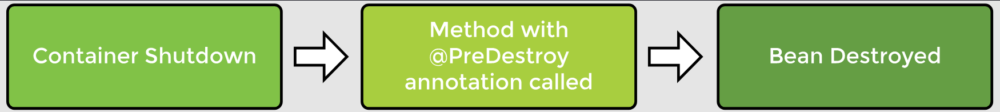
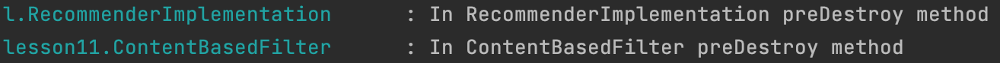

# Lesson 11: Bean Lifecycle: @PostConstruct, @ PreDestroy

## Overview

Spring manages the entire lifecycle of beans from the time they are created till the time they are destroyed. It provides post-initialization and pre-destruction callback methods on the beans. The developer can tap into these callbacks and write custom initialization and cleanup code.

In this lesson, we use the `slf4j` logger to log the sequence of events in our application instead of `System.out.println`. Loggers offer flexibility, as well as better output, that includes timestamp, name of the thread executing the code, and the name of the class. This information comes in handy when debugging applications. We will declare a logger and import the relevant files as follows:

```java
import org.slf4j.Logger;
import org.slf4j.LoggerFactory;

@Component
public class RecommenderImplementation {

    private Logger logger = LoggerFactory.getLogger(this.getClass());
    //...
}
```

Similarly, we will declare a `logger` in the `ContentBasedFilter` class as well.

Next, we will create a setter method in `RecommenderImplementation` to inject the `Filter` dependency and display a logging message as follows:

```java
@Component
public class RecommenderImplementation {

    //...
    private Filter filter;
 
    @Autowired
    public void setFilter(Filter filter) {
     logger.info("In RecommenderImplementation setter method..dependency injection");
     this.filter = filter;
    }
    //...
}
```

## Demonstrated Concepts

### `@PostConstruct`

When Spring creates a bean, the first thing it does, is to autowire the dependencies. If the developer wants to perform a task after the dependencies have been populated, it can be done by calling a method annotated with the `@PostConstruct` annotation. A method with this annotation works like the `init` method. The `@PostConstruct` annotation tells Spring to call the method for us once the object has been created. The method can have any name and its return type is always `void`. After the bean is created, we can initialize the contents of the bean, load data, establish a database connection, or connect to a web server. The post construct method is only called after all the dependencies have been populated.



We create a method called `postConstruct` in the `RecommenderImplementation` class and use the `@PostConstruct` annotation on it. This method can have any name.

```java
import javax.annotation.PostConstruct;

@Component
public class RecommenderImplementation {

    //...

    @PostConstruct
    public void postConstruct() {
        //initialization code goes here
        logger.info("In RecommenderImplementation postConstruct method");
    }

    //...
}
```

Similarly, for the `ContentBasedFilter` class, the constructor and post construct method are shown below:

```java
@Component
public class ContentBasedFilter implements Filter{
    //...
    public ContentBasedFilter() {  
        super();
        logger.info("In ContentBasedFilter constructor method");        
    }
 
    @PostConstruct
    private void postConstruct() {
        //load movies into cache
        logger.info("In ContentBasedFilter postConstruct method");
    }
 
    //...
}
```

In the `main` method, we will create a `RecommenderImplementation` bean and observe the order in which the constructor and post construct methods of the bean and its dependency are called.

```java
public static void main(String[] args) {

    ApplicationContext appContext = SpringApplication.run(
            MovieRecommenderSystemApplication.class, args);
    
    //use ApplicationContext to get recommender object
    RecommenderImplementation recommender = appContext.getBean(
            RecommenderImplementation.class);   

    System.out.println(recommender);
}
```

The logger messages give an insight into the sequence of events after the container is initialized. 



The logger output looks something like this in IntelliJ IDE:


### `@PreDestroy`

The callback method that is executed just before the bean is destroyed is annotated using `@PreDestroy`. The method having this annotation is called when the bean is in the process of being removed from the container. All cleanup stuff can be performed in this method. A method with the `@PreDestroy` annotation can be used to release resources or close a database connection.



We write our custom destroy method in both the `RecommenderImplementation` and `ContentBasedFilter` classes as follows:

```java
import javax.annotation.PreDestroy;

@Component
public class RecommenderImplementation {
    //...

    @PreDestroy
    public void preDestroy() {
        //cleanup code
        logger.info("In RecommenderImplementation preDestroy method");
    }
}
```

```java
@Component
public class ContentBasedFilter 
implements Filter{

    //...

    @PreDestroy
    private void preDestroy() {
        //clear movies from cache
        logger.info("In ContentBasedFilter preDestroy method");
    }
}
```

The log shows that when the `RecommenderIplementation` bean is in the process of being destroyed, its `PreDestroy` method is called followed by the `ContentBasedFilter` bean’s `PreDestroy` method.


