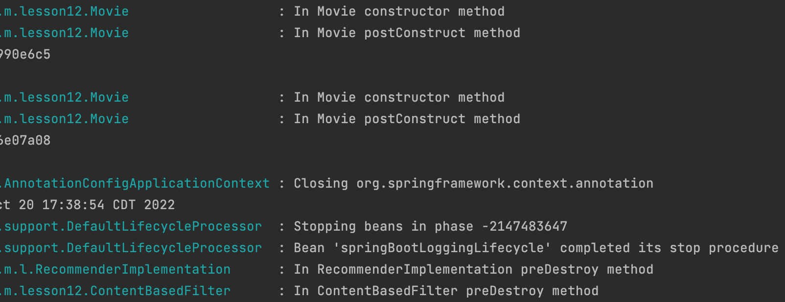

# Lesson 12: Bean Lifecycle: Prototype Scoped Beans

## Demonstrated Concepts

### Lifecycle of prototype beans

Spring manages the entire lifecycle of singleton beans but it does not completely manage the lifecycle of prototype beans. This is because there might be a large number of prototype instances and the container can become overwhelmed keeping track of them.

> The Spring container creates the prototype beans and hands them over when requested. Thereafter, it is the responsibility of the application to destroy the bean and free up any resources that it has acquired.

The `Movie` class shows that the post initialization method is called but the pre-destruction method is not called for prototype beans. This class has prototype scope as shown:

```java
@Component
@Scope(value=ConfigurableBeanFactory.SCOPE_PROTOTYPE, 
       proxyMode=ScopedProxyMode.TARGET_CLASS)
public class Movie {

    private Logger logger = LoggerFactory.getLogger(this.getClass());
 
    private int id;
    private String name;
    private String genre;  
    private String producer; 
    //...
}

```

### Post-construct method

We add a constructor and post construct method to this class as follows:

```java
public Movie() {
    super();
    logger.info("In Movie constructor method");     
}

@PostConstruct
private void postConstruct() {
    //initialization code
    logger.info("In Movie postConstruct method");
}
```

### Pre-destroy method

The `Movie` class has a pre-destroy method, `preDestroy` as follows:

```java
@PreDestroy
private void preDestroy() {
    //cleanup code
    logger.info("In Movie preDestroy method");
}  
```

In the `main` method, we will retrieve a singleton `RecommenderImplementation` and two prototype `Movie` beans from the application context.

```java
public static void main(String[] args) {

    ApplicationContext appContext = SpringApplication.run(MovieRecommenderSystemApplication.class, args);

    //Retrieving singleton bean from application context
    RecommenderImplementation recommender = appContext.getBean(RecommenderImplementation.class);   
    System.out.println(recommender);

    //Retrieving prototype bean from application context twice
    Movie m1 = appContext.getBean(Movie.class);
    System.out.println(m1);

    Movie m2 = appContext.getBean(Movie.class);
    System.out.println(m2);

}
```

When the application is run, we can see that the constructor and post construct methods of the singleton `RecommenderImplementation` bean (and its dependency, `ContentBasedFilter` bean) are called when the bean is created, before the application starts.

The prototype bean is not created beforehand and the constructor and post construct methods for the `Movie` bean are only called when we request the application context for the `Movie` bean.

When the application terminates, the `PreDestroy` method is called for the singleton `RecommenderImplementation` bean (and its dependency `ContentBasedFilter` bean) but not for the prototype scoped `Movie` bean.

