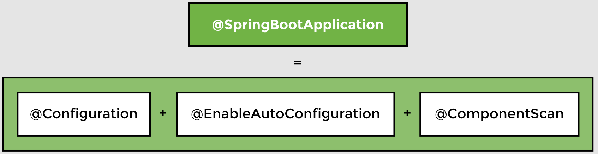

# Lesson 14: Spring Application Configuration

## Overview

The Movie Recommender System we have used in this course was created using Spring Boot. Let’s look at how it can be run using the core features of Spring.

In this lesson, we remove the dependencies autoconfigured by Spring Boot and replace them with the dependencies needed for a Spring project.


The changes that we make in this lesson that enabled us to run a Spring Boot application as a basic Spring application are as follows:

- Removing the `spring-boot` starter dependency and replacing it with `spring-core` and `spring-context`.
- Replacing `@SpringBootApplication` with `@Configuration` and `@ComponentScan`.
- Replacing the `SpringApplication` class with the `AnnotationConfigApplicationContext` class.

> __Note from `ginny100`:__ Highly recommend creating a whole new project using Spring Initializr with a separate `pom.xml` file and all files from `lesson14` package of this current project to follow along in this lesson.

## Demonstrated Concepts

### `spring-core` dependency

`spring-core` provides the fundamental features of Spring framework like dependency injection and Inversion of Control.

Since we created our application using Spring Initializr, it has the `spring-boot-starter` dependency in the `pom.xml` file. This dependency brings in Spring Boot functionality. In this lesson, we will replace it with spring-core.

```xml
<!-- comment out the following dependency:
<dependency>
<groupId>org.springframework.boot</groupId>
    <artifactId>spring-boot- starter</artifactId>
</dependency>   
-->

<!-- replace it with this dependency: -->
<dependency>
 <groupId>org.springframework</groupId>
 <artifactId>spring-core</artifactId>
</dependency>
```

`spring-core` defines the bean factory and forms the base of the Spring framework.

### `spring-context` dependency

To be able to use `ApplicationContext`, we need to add another dependency called `spring-context` as follows:

```xml
<dependency>
 <groupId>org.springframework</groupId>
 <artifactId>spring-context</artifactId>
</dependency>
```

By removing the `spring-boot-starter` dependency, the `@SpringBootApplication` annotation will no longer be available when we run the Java application. However, this annotation can be used in test scope because we still have the `spring-boot-starter-test` dependency in `pom.xml`.

### `@Configuration`

`@SpringBootApplication` cannot be used in the Java application file anymore as we have replaced the `spring-boot-starter` dependency with `spring-core`. This annotation defined the application configuration in Spring Boot. In the Java realm, we use `@Configuration` and import the __org.springframework.context.annotation.Configuration__ jar.

### AnnotationConfigApplicationContext

If we run the application now, the following compilation error is encountered:

_Unresolved compilation problem: SpringApplication cannot be resolved._

The `SpringApplication` class creates the application context. It belongs to the __org.springframework-boot__ package. When using the `spring-core`, the application context is created using `AnnotationConfigApplicationContext` class as follows:

```java
//ApplicationContext manages the beans and dependencies

/*Change this:
ApplicationContext appContext =              
     SpringApplication.run(MovieRecommenderSystemApplication.class, args);
*/

//to this:
AnnotationConfigApplicationContext appContext = new AnnotationConfigApplicationContext(MovieRecommenderSystemApplication.class);
```

### `@ComponentScan`

If we try to run the application now, it throws the `NoSuchBeanDefinition` exception, which means that the application context is unable to locate beans declared using `@Component`. We need to help it in component scanning by providing the `@ComponentScan` annotation on the `MovieRecommenderSystemApplication` class.



The `@SpringBootApplication` annotation performs multiple tasks. Now that it has been removed, we need to explicitly use the `@ComponentScan` annotation to guide Spring to the package which contains the beans.

After making these changes, we are able to run the same application without using Spring Boot!

### Closing the application context

Spring Boot automatically closes the application context in the end, but now we need to close the context as follows:

```java
//close the application context
appContext.close();
```

Another way is to use a try catch block around the statement creating `appContext`. In this way, any error will result in the context being automatically closed.

```java
try( AnnotationConfigApplicationContext appContext = 
  new AnnotationConfigApplicationContext(MovieRecommenderSystemApplication.class)) {
    //...
}
```