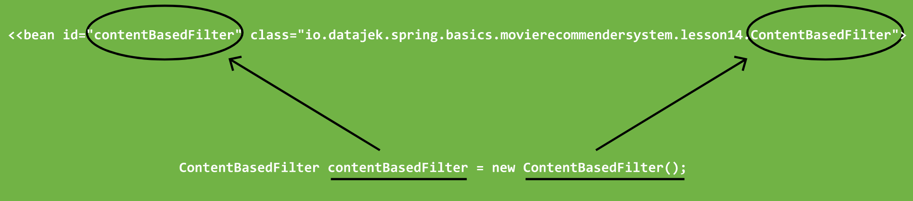
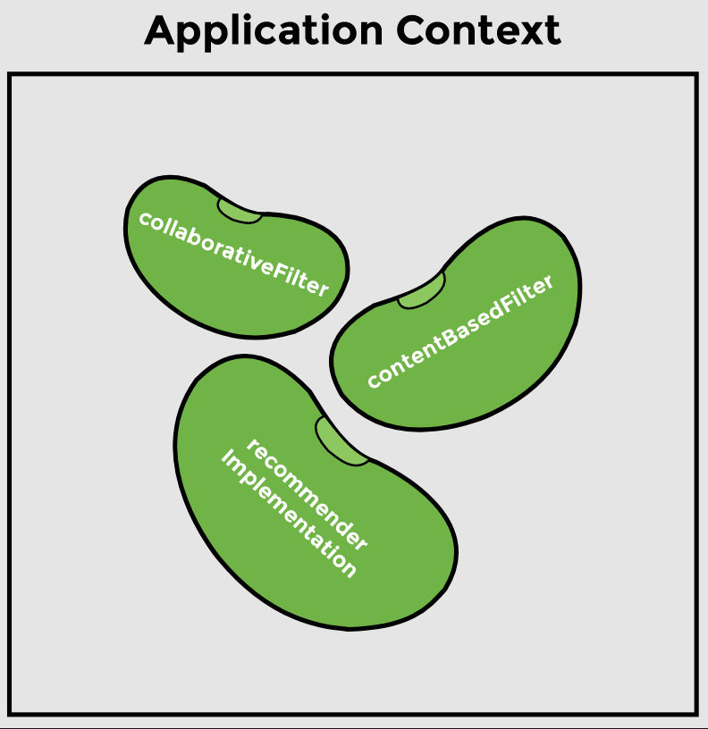

# Lesson 15: XML Application Configuration

## Overview

In this lesson, we will learn how to configure a Spring application using XML. We will remove annotations from our application altogether and use XML to define beans and dependencies.

> __Note from `ginny100`:__ Highly recommend creating a whole new project using Spring Initializr with the whole `lesson15` package of this current project to follow along in this lesson.

## Demonstrated Concepts

### XML configuration file

The first step is creating an XML file that contains the bean definitions. Spring will read this file and know which beans to create and manage. We will create an XML file in __src/main/resources__ and call it `appContext.xml`.

First, we need to provide some metadata for validating the tags which will be used in this file. The metadata defines the schema location of the tags, as shown:

```xml
<beans xmlns="http://www.springframework.org/schema/beans"
       xmlns:xsi="http://www.w3.org/2001/XMLSchema-instance"
       xsi:schemaLocation="http://www.springframework.org/schema/beans                    
       http://www.springframework.org/schema/beans/spring-beans.xsd">

<!-- bean definitions -->
</beans>
```

### `<bean>` tag

Next, we define the beans inside this metadata using the `<bean> </bean>` tag. For every bean, we need to specify the fully-qualified class name as well as a reference id. The fully-qualified class name is the class name along with its package name. Earlier, we used `@Component` at three places in our application. Now we will declare three beans as follows:

```xml
<bean id="contentBasedFilter" 
class="io.datajek.spring.basics.movierecommendersystem.lesson14.ContentBasedFilter">
</bean>

<bean id="collaborativeFilter" 
class="io.datajek.spring.basics.movierecommendersystem.lesson14.CollaborativeFilter"> 
</bean>

<bean id="recommenderImplementation"     
class="io.datajek.spring.basics.movierecommendersystem.lesson14.RecommenderImplementation">
</bean>
```

The IOC container will read the `appContext.xml` file and create objects of the classes mentioned in it. It will call the constructor of the class to create the object by giving it the name that we specified as the id. Hence, the following line:

```xml
<bean id="contentBasedFilter" 
class="io.datajek.spring.basics.movierecommendersystem.lesson14.ContentBasedFilter">   
</bean >   
```

translates to:

```java
ContentBasedFilter contentBasedFilter = new ContentBasedFilter();
```



After reading `appContext.xml` file, the IOC container creates the following beans:



### `ClassPathXmlApplicationContext`

Inside the `main` method, the application context will be created using `ClassPathXmlApplicationContext` by providing the name of the XML config file as an argument:

```java
ClassPathXmlApplicationContext appContext = new ClassPathXmlApplicationContext("appContext.xml");
```

Once the context is loaded, we can check which beans are present using the `getBeanDefinitionNames` method:

```java
//check the beans which have been loaded
System.out.println("\nBeans loaded:");
System.out.println(Arrays.toString(appContext.getBeanDefinitionNames()));
```

We can also retrieve a bean using the `getBeans` method by providing the bean id (defined in the `appContext.xml` file) along with the class name as follows:

```java
//retrieve bean from the application context
RecommenderImplementation recommender = appContext.getBean("recommenderImplementation", RecommenderImplementation.class);
```

### Dependency injection

In our application, `Filter` is a dependency of `RecommenderImplementation`. In XML, a dependency can be defined in multiple ways:

#### Using `<property>` tag

We can create getter and setter methods for the `filter` dependency as follows:

```java
public class RecommenderImplementation {
 
    private Filter filter;

    public Filter getFilter() {
        return filter;
    }

    public void setFilter(Filter filter) {
        this.filter = filter;
    }
    //...
}
```

To define this dependency, we will modify the `<bean>` tag created in step 2 and use `<property>` tag for the dependency as follows:

```xml
<bean id="recommenderImplementation"     
 class="io.datajek.spring.basics.movierecommendersystem.lesson14.RecommenderImplementation">
 <property name="filter" ref="collaborativeFilter"/> 
</bean>
```

The setter method `setFilter` will be used to set the `filter` dependency in the `recommenderImplementation` object by passing the reference of the `collaborativeFilter` object. We can change the `ref` property to use the `contentBasedFilter` bean as well.

A no-arg constructor is needed for the above-mentioned dependency injection to work, if the `RecommenderImplementation` class has a constructor for setting `filter` dependency.

#### Using constructor injection

Instead of using the setter method, we can define a constructor in the `RecommenderImplementation` class as follows:

```java
public class RecommenderImplementation {
 
    private Filter filter;

    public RecommenderImplementation(Filter filter) {
        this.filter = filter;
    }
    //...
}
```

To use the constructor method defined above, we will use the `<constructor-arg>` tag in the bean tag created in step 2 as follows:

```xml
<bean id="recommenderImplementation"     
 class="io.datajek.spring.basics.movierecommendersystem.lesson14.RecommenderImplementation">
 <constructor-arg ref="collaborativeFilter"/> 
</bean>
```

This tells Spring to pass a bean called `collaborativeFilter` as a constructor argument when creating the `recommenderImplementation` object. We can change the name of the argument to autowire `contentBasedFilter` as well.

After dependency injection, we can run the application to find movie recommendations in the `main` method:

```java
//retrieve bean from the application context
RecommenderImplementation recommender = appContext.getBean("recommenderImplementation", 
                                                            RecommenderImplementation.class);
//call method to get recommendations
String[] result = recommender.recommendMovies("Finding Dory");
         
//display results
System.out.println(Arrays.toString(result));
```

From the output, it can be seen that the dependency has been autowired.

### Closing the context

The last step is to close the context, just like we did in the previous lesson.

```java
appContext.close();
```

We are now ready to run the application using XML configuration.