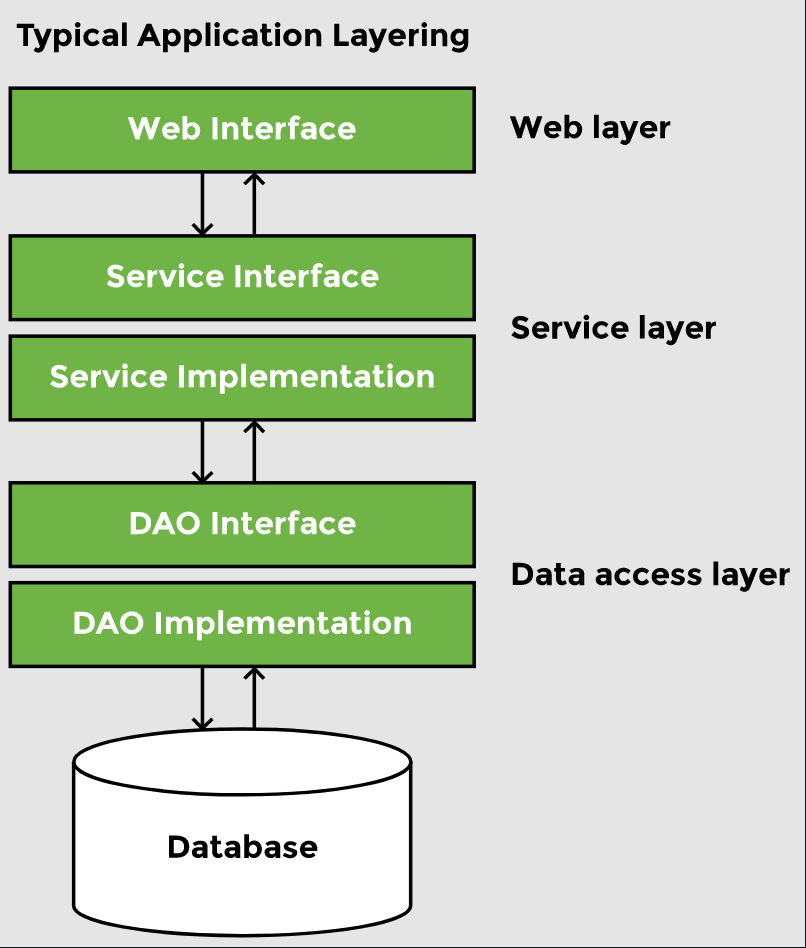
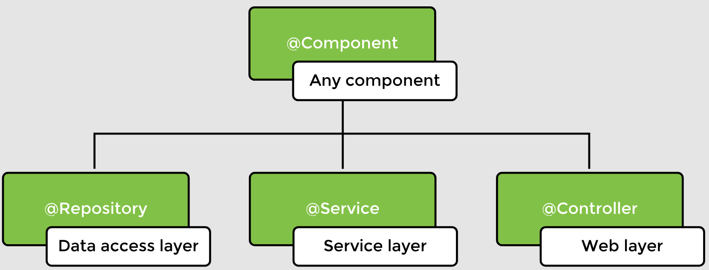
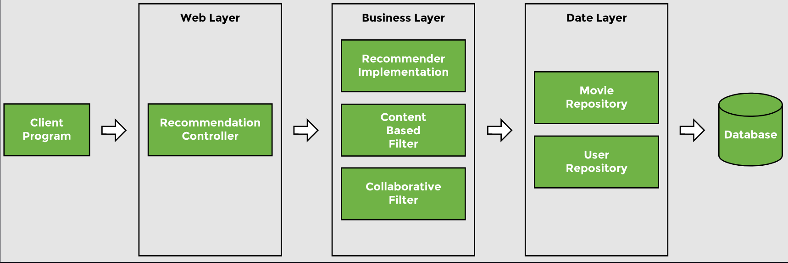

# Lesson 18: Stereotype Annotations

## Overview

We have learned how to define beans using the `@Component` annotation as well as XML configuration with the `<bean>` tag. But there are other ways to define beans.

Beans can be declared using the `@Bean` annotation in a configuration class or by using the `@Controller`, `@Service`, and `@Repository` annotations. These annotations are used at different layers of an enterprise application. A typical application has the following layers:

- The __web__ or __UI layer__ interacts with the client program.
- The __service layer__ provides an abstraction between the web and data access layer as well as taking care of the business logic.
- The __data layer__ interacts with a database or an external interface.

In our sample code, the `RecommenderImplementation` class contains the business logic. The filter algorithm contained in the `ContentBasedFilter` class also falls in the category of business logic. The `Movie` class is responsible for loading movie data from a movie repository as well as comparing movies to find similarity, so it represents the data access layer. Note that, we haven’t written the logic of retrieving movie data yet. All the above-mentioned classes contain the `@Component` annotation.

## Demonstrated Concepts

The `@Controller`, `@Service`, and `@Repository` annotations are similar to `@Component` annotation with respect to bean creation and dependency injection, except that they provide specialized functionality

### `@Component`

`@Component` is a generic annotation which can be used in any layer when the developer is unsure about where the bean belongs. The other three annotations, `@Controller`, `@Service`, and `@Repository`, are specific to layers. We can replace the `@Component` annotation with stereotype annotations.

### `@Controller`

`@Controller` is used to define a controller in the __web layer__. Spring scans a class with `@Controller` to find methods that are mapped to different HTTP requests and makes sure that the right view is rendered to the user. `@RestController` is a specialized form of `@Controller`.

### `@Service`

`@Service` is used in the __business layer__ for objects that define the business logic. It marks a class as a service provider.

Instead of `@Component`, we can use the `@Service` annotation for classes with business logic i.e., `RecommenderImplementation` and `ContentBasedFilter` in our sample code.

### `@Repository`

`@Respository` is used in the __data layer__ to encapsulate storage, retrieval, and search in a typical database. This annotation can also be used for other external sources of data.

For the `Movie` class, we can replace the `@Component` annotation with `@Repository` annotation as it belongs to the data access layer.

## Extra Information

Right now, there is no web layer in our application, but we can have a `RecommendationController` class marked with `@Controller` that calls the classes in the business layer. Likewise, we should also have a `User` class marked with `@Repository` to hold the user watch history and movie preference data for our recommender system.

The advantage of having annotations specific to every layer instead of the generic `@Component` is in Aspect Oriented Programming (AOP). We can identify the annotations and add functionality to specific annotations. Similarly, we can classify components in different categories and apply a specific logic to each category.

Spring provides a default exception translation facility for JDBC exceptions if the `@Repository` annotation is used. This feature cannot be used on beans annotated with `@Component`. When using a persistence framework like Hibernate, exceptions thrown in a class with the `@Repository` annotation are caught and automatically translated into Spring’s `DataAccessException` class.

The request mapping feature is enabled only when using the `@Controller` annotation. The `DispatcherServlet` automatically looks for `@RequestMapping` for classes marked with the `@Controller` annotation only.