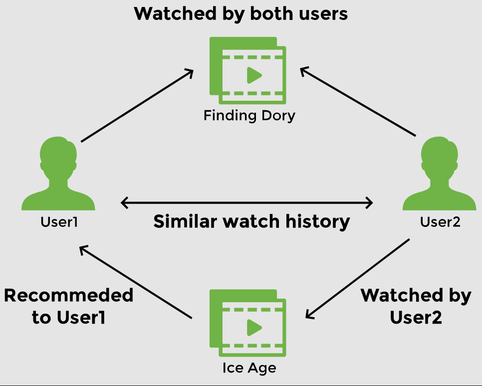
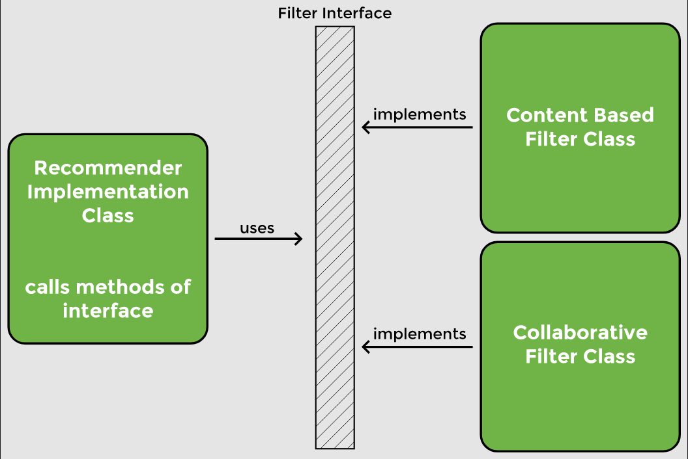

# Lesson 2: Decoupling Components

## Overview

Right now, the `RecommenderImplementation` class is hard coded to use the `ContentBasedFilter` class. If we need to change the way our application recommends movies, we will need to change the code of the `RecommenderImplementation` class.

Say, we want to switch from _ContentBased_ filter to _Collaborative_ filter and take into account the preferences of users having a similar watch history.



## Demonstrated Concepts

### Loose coupling

Loose coupling can be achieved by making the `RecommenderImplementation` class use the interface instead of one of its implementations. We will create a constructor for the `RecommenderImplementation` class to initialize the `Filter`.

```java
public class RecommenderImplementation {
    
    //use filter interface to select filter
    private Filter filter;
            
    public RecommenderImplementation(Filter filter) {
        super();
        this.filter = filter;
    }
    
    //use a filter to find recommendations
    public String [] recommendMovies (String movie) {
        //...
    }
}
```

The method `getRecommendations` now belongs to the interface. To check which implementation of the interface is being used to get movie recommendations, we can print the name of the filter as follows:

```java
public String [] recommendMovies (String movie) {
    
    //print the name of interface implementation being used
    System.out.println("Name of the filter in use: " + filter + "\n");
        
    String[] results = filter.getRecommendations("Finding Dory");
        
    return results;
}
 ```

By using the interface instead of an actual implementation, we can dynamically choose which algorithm to use. Our code has now become _loosely coupled_. In the `MovieRecommenderSystemApplication` file, when we create a `RecommenderImplementation` object, we can pass the name of the filter to use:

```java
RecommenderImplementation recommender = new RecommenderImplementation(new ContentBasedFilter());
```

When we run the application, it prints the name of the filter along with the results.

Let’s now change the code to use the `CollaborativeFilter` and see the output change.

```java
RecommenderImplementation recommender = new RecommenderImplementation(new CollaborativeFilter());
```

In this lesson, we make `RecommenderImplementation` class independent of the filter implementation. The `RecommenderImplementation` now calls methods of the `Filter` interface.

    

Now __Filter__ is a dependency of `RecommenderImplementation`. We still have to create an object of `RecommenderImplementation` and an object of `Filter` and pass the objects to the constructor. In the next lesson, we will see how Spring takes over the job of managing dependencies.