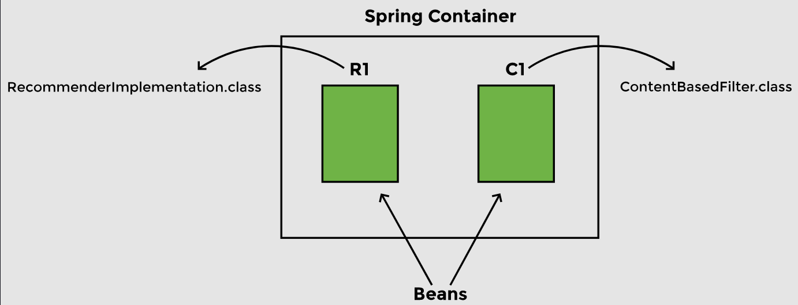
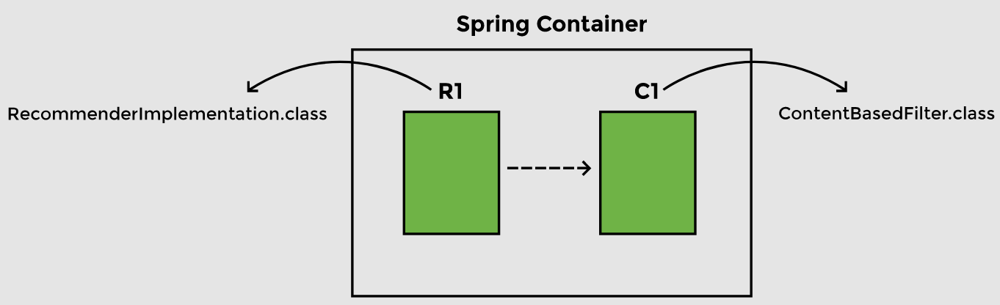

# Lesson 3: Managing Beans and Dependencies

## Overview

- So far, we have created objects of `RecommenderImplementation` class and two classes implementing the `Filter` interface. We are binding the objects together in the constructor. Our code is now _loosely coupled_ as we are passing the name of the filter to be used as a constructor argument.

- Spring automates the above process of creating objects and binding them together. It takes the responsibility of creating instances of classes and binding instances based on their dependencies. The instances or objects that Spring manages are called __beans__. To manage objects and dependencies, Spring requires information about three things:

    - Beans 
    - Dependencies 
    - Location of beans

## Demonstrated Concepts

### `@Component`

- If we want Spring to create and manage objects, we can do so by adding the `@Component` annotation at the beginning of the class and importing __org.springframework.stereotype.Component__.

- For now, we want Spring to manage objects of `RecommenderImplementation` and `ContentBasedFilter` class only, so we will add the `@Component` annotation at two places in the code:

  ```java
  import org.springframework.stereotype.Component;
    
  @Component
  public class RecommenderImplementation {
    //...
  }
  ```
  
  ```java
  import org.springframework.stereotype.Component;
  
  @Component
  public class ContentBasedFilter implements Filter {
    //...
  }
  ```
  
- The Spring container will have two beans, one of type `RecommenderImplementation` and the other of type `ContentBasedFilter`.

  

### `@Autowired`

- The second thing Spring needs to know is the dependencies of each object. The `@Autowired` annotation is used for this purpose, and we need to import __org.springframework.beans.factory.annotation.Autowired__ to be able to use this annotation. 

- In our application, the `ContentBasedFilter` class (which implements the `Filter` interface) is a dependency of the `RecommenderImplementation` class.

  ```java
  import org.springframework.stereotype.Component;
  import org.springframework.beans.factory.annotation.Autowired;
  
  @Component
  public class RecommenderImplementation {
  
    @Autowired
    private Filter filter;
    // ...
  }
  ```

- The `@Autowired` annotation tells Spring that `RecommenderImplementation` needs an object of type `Filter`. In other words, `Filter` is a dependency of `RecommenderImplementation`.

  

### `@ComponentScan`

- The third thing that Spring requires from the developer, is the location of the beans so that it can find them and autowire the dependencies. The `@ComponentScan` annotation is used for this purpose. This annotation can be used with or without arguments. It tells Spring to scan a specific package and all of its sub-packages. In our case, all the files that contain beans are in the same package, `io.datajek.springbasics`, so we want Spring to do a component scan on this package.

- Since we are using Spring Boot, it uses the `@SpringBootApplication` annotation on the `MovieRecommenderSystemApplication` class. This annotation is equivalent to the following three annotations:

  - `@Configuration`, which declares a class as the source for bean definitions

  - `@EnableAutoConfiguration`, which allows the application to add beans using classpath definitions

  - `@ComponentScan`, which directs Spring to search for components in the path specified

  

- Because of `@SpringBootApplication` annotation, we do not need to use `@ComponentScan` annotation in our code.

### `@SpringBootApplication`

- `@SpringBootApplication` tells Spring to scan all the files in the package where the class with this annotation is present. It also scans any sub-packages of the package where it is placed.

- When we use the `@Component`, `@Autowired`, and `@SpringBootApplication` annotations, the following line in our code becomes redundant as it is automatically done by Spring:
  
  ```java
  RecommenderImplementation recommender = new RecommenderImplementation(new ContentBasedFilter());
  ```
  
  - The beans that Spring creates are managed by the _Application Context_. We can get information about a bean from the Application Context. The `run` method returns the `ApplicationContext`, which can be assigned to a variable `appContext`. Then the `getBean` method of `ApplicationContext` can be used to get the bean of a particular class. We will create a local variable `recommender` and assign the bean to it as follows:

  ```java
  public static void main(String[] args) {
    
    //ApplicationContext manages the beans and dependencies
    ApplicationContext appContext = SpringApplication.run(        
                                             MovieRecommenderSystemApplication.class, args);

    //use ApplicationContext to find which filter is being used
    RecommenderImplementation recommender = appContext.getBean(
                                             RecommenderImplementation.class);  
    
    //call method to get recommendations
    String[] result = recommender.recommendMovies("Finding Dory");
    
    //display results 
    System.out.println(Arrays.toString(result));
  }
  ```
  
  - Instead of us having to create an instance of the `RecommenderImplementation` class, Spring Application Context creates the beans. We can simply pick it up from there and use it to execute the `RecommendMovies` method.

  - This might look complex to a beginner, but consider for a moment an application that has hundreds of beans, each having a number of dependencies. The fact that we do not have to explicitly create beans and manually wire in the dependencies makes the job of a developer very easy.

  - When we run this application, the output shows that the bean being used is `ContentBasedFilter`. If the `@Component` annotation is used on the `CollaborativeFilter` class instead of the `ContentBasedFilter` class, the output will change accordingly:

- To understand what goes on in the background, we will change the logging level to debug. This can be done by adding the following to the `application.properties` file in `src/main/resources`:

  ```
  Logging.level.org.springframework = debug
  ```

- When run, the code will show the log of all the actions that are being performed in the background. A summary of the actions is reproduced below:

  - _Loading source class…_: The package is being searched. Spring starts with a component scan to find anything with `@Component` as well as other annotations that we will discuss in future lessons.

  - _Identified candidate component class…_: Spring identifies two candidates which have the `@Component` annotation as we only used it in two places in our code.

  - _Creating shared instance of singleton bean ‘movieRecommenderSystemApplication’_, _Creating shared instance of singleton bean ‘contentBasedFilter’_: Spring starts creating instances of the beans. It creates beans that do not have any dependency first.

  - _Creating shared instance of singleton bean ‘recommenderImplementation’_, _Autowiring by type from bean name ‘recommenderImplementation’ via constructor to bean named ‘contentBasedFilter’_: Now Spring can autowire the dependency using the constructor that we have provided and creates the `RecommenderImplementation` bean.

- To better understand these annotations, play around with the code and see what error messages Spring throws when some  annotations are missing. The error message can be found at the end of the log.

  - If we remove `@Component` from the `ContentBasedFilter` class, Spring will throw an error when trying to autowire the dependency saying it required a bean of type `Filter` that could not be found.

  - If we remove `@Component` from the `RecommenderImplementation` class as well, we will get an error when trying to execute the `getBean` method as no beans exist.

  - If we add `@Component` to the `CollaborativeFilter` class, Spring will not know which bean of `Filter` type to autowire. It says, “expected single matching bean but found two”. We will see how to resolve this in the next lesson.