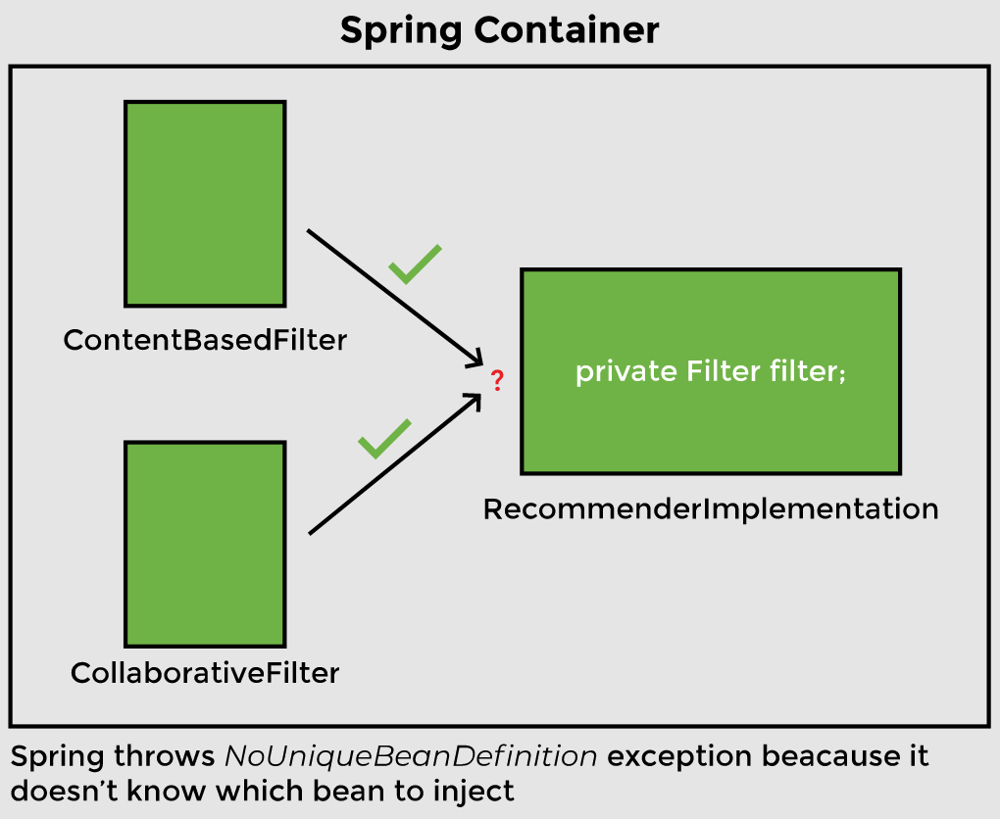
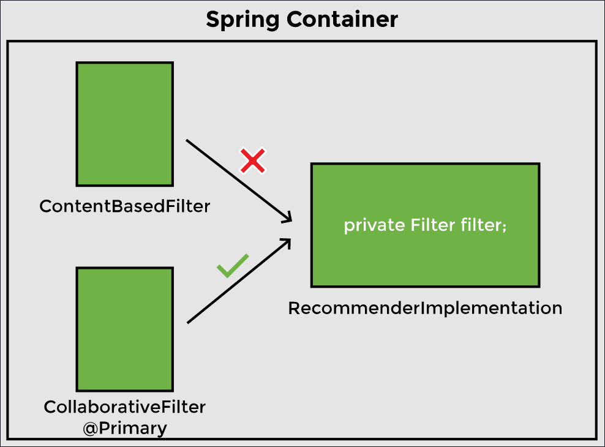

# Lesson 4: Autowiring By Type — @Primary

## Overview

In the last lesson, we saw Spring manage two beans of the `RecommenderImplementation` and `ContentBasedFilter` classes for us. In this lesson, we will add another bean and see how Spring can dynamically choose a bean if it finds two matches of the same type.

## Demonstrated Concepts

### NoUniqueBeanDefinitionException

We will add the `@Component` annotation on the `CollaborativeFilter` class to declare it a bean. Now both implementations of the `Filter` interface are beans. Previously, when Spring searched for a dependency to be autowired in the `RecommenderImplementation` object, it only found one bean of matching type. Now when we run the application, it fails to start.

The `NoUniqueBeanDefinitionException` occurs. The error message says: Required a single bean but two were found.

### @Primary annotation

One way Spring can choose between two beans of the same type is by giving one bean priority over the other. The `@Primary` annotation is used for making a component the default choice when multiple beans of the same type are found.

Let’s say we want the collaborative filter to take precedence. We will add the `@Primary` annotation on the `CollaborativeFilter` class and import __org.springframework.context.annotation.Primary__. When we run the application now, it uses `CollaborativeFilter` as expected.

Using `@Primary` is called _autowiring by type_. We are looking for instances of type `Filter`.

If we make both beans primary by adding the `@Primary` annotation to both implementations of the `Filter` interface, we will get an error. This happens because Spring doesn’t know which one to inject in the `RecommenderImplementation` object. The error message states “more than one ‘primary’ bean found among candidates".