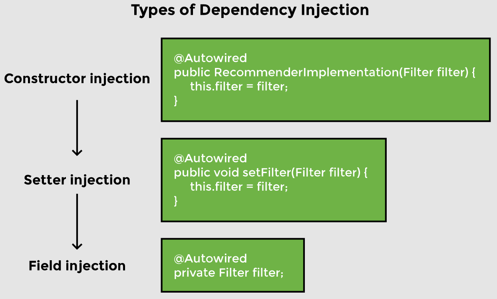

# Lesson 7: Constructor and Setter Injection

## Overview

So far, we have learnt that Spring framework identifies dependencies and wires them in. Spring framework gives the developer control over how beans are wired in. There are a variety of options to choose from. We will focus on _constructor injection_ and _setter injection_.

## Demonstrated Concepts

### Constructor injection

Autowiring the dependency using a constructor is called _constructor injection_. We will create a constructor in the `RecommenderImplementation` class that initializes the filter to be used for finding movie recommendations as follows:

```java
public RecommenderImplementation( Filter filter) {
    this.filter = filter;
    System.out.println("Constructor invoked...");
}
```

Since we have two implementations of the `Filter` interface, we need to specify which one to use. If we use the `@Primary` annotation, then Spring will use the primary bean as the default choice. However, if we want different beans to be used in different scenarios, then the `@Qualfier` annotation with the bean name can be used to give a hint to Spring about which bean to inject. Since, we have not specified bean names with the `@Component` annotation, their default names (`contentBasedFilter` and `collaborativeFilter`) will be used.

> _Default bean name is the class name with the first letter in lowercase._

To use constructor for injecting dependencies, we can move the `@Autowired` annotation to the constructor. We will also use the `@Qualifier` annotation to inject the bean of `CollaborativeFilter` type. The `@Qualifier` annotation cannot be used on the constructor (as it results in an error message: _“The annotation @Qualifier is disallowed for this location”_), rather, it should be used in the argument list right in front of the property that we want to be autowired as shown:

```java
@Autowired
public RecommenderImplementation(@Qualifier("collaborativeFilter") Filter filter) {
    this.filter = filter;
    System.out.println("Constructor invoked...");
}
```

It should also be noted that the use of the `@Autowired` annotation is optional when using constructors.

In the `main` method, we will call the `getBean` method to show that constructor injection takes place and `CollaborativeFilter` bean is injected as follows:

```java
public static void main(String[] args) {
    
    ApplicationContext appContext = SpringApplication.run(
                                    MovieRecommenderSystemApplication.class, args);

    //RecommenderImplementation injects dependency using constructor
    System.out.println("Calling getBean() on RecommenderImplementation");
    RecommenderImplementation recommender = appContext.getBean(
                                                  RecommenderImplementation.class); 

    String[] result = recommender.recommendMovies("Finding Dory");
    System.out.println(Arrays.toString(result));
}
```

When the application is run, Spring injects the `CollaborativeFilter` bean in the `RecommenderImplementation` class using the constructor. The “Constructor invoked…” message is printed on the console.

### Setter injection

Another way to wire in a dependency is by using a setter method. We will create a setter method in the `RecommenderImplementation2` class called `setFilter` as follows:

```java
public void setFilter(Filter filter) {
    this.filter = filter;
    System.out.println("Setter method invoked..");
}
```

We can guide Spring to use the setter method by using the `@Autowired` annotation before the method. We will also use the `@Qualifier` annotation to instruct Spring to use the `ContentBasedFilter` bean as follows:

```java
@Autowired
@Qualifier("contentBasedFilter")
public void setFilter(Filter filter) {
    //...
}
```

In the `main` method, we will call the `getBean` method to show that setter injection takes place and `ContentBasedFilter` bean is injected as follows:

```java
public static void main(String[] args) {
    
    ApplicationContext appContext = SpringApplication.run(
                                    MovieRecommenderSystemApplication.class, args);

    //...
  
    //RecommenderImplementation2 injects dependency using setter method
    System.out.println("Calling getBean() on RecommenderImplementation2");
    RecommenderImplementation2 recommender2 = appContext.getBean(
                                                 RecommenderImplementation2.class); 

    result = recommender2.recommendMovies("Finding Dory");
    System.out.println(Arrays.toString(result));
}
```

When the application is run, Spring injects the `ContentBasedFilter` bean in the `RecommenderImplementation2` class using the `setFilter` method. The “Setter invoked…” message is also displayed on the console.

### Field injection

We have seen two dependency injection methods above but Spring was already performing dependency injection without a constructor or setter method in the `RecommenderImplementation` class. We have been using `@Autowired` annotation directly on the `Filter` field. This is called _field injection_.

```java
public class RecommenderImplementation {
    @Autowired
    private Filter filter;
    
    //...    
}
```

Using field injection keeps the code simple and readable, but it is unsafe because Spring can set private fields of the objects. Testing also becomes inconvenient because we need a way to perform dependency injection for testing. Yet another disadvantage is that a developer may add a lot of optional dependencies which can make the application complex. If there was a constructor, then each additional dependency would result in increasing the number of arguments of the constructor.



Both constructor and setter injection result in the same outcome. However, there are some differences. Setter injection is more readable as it specifies the name of the dependency as the method name but the number of setter methods increases with each increasing dependency increasing the boiler plate code. Setter injection is used to avoid the _BeanCurrentlyInCreationException_ raised in case of a circular dependency, because unlike constructor injection where dependencies are injected at the time when context is loaded, setter injection injects dependencies when they are needed.

Constructor injection ensures that all dependencies are injected because an object cannot be constructed until all its dependencies are available. It also ensures immutability as the state of the bean cannot be modified after creation.