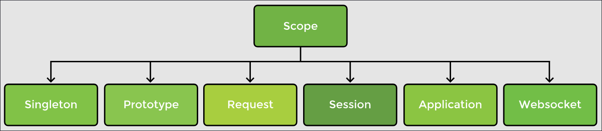
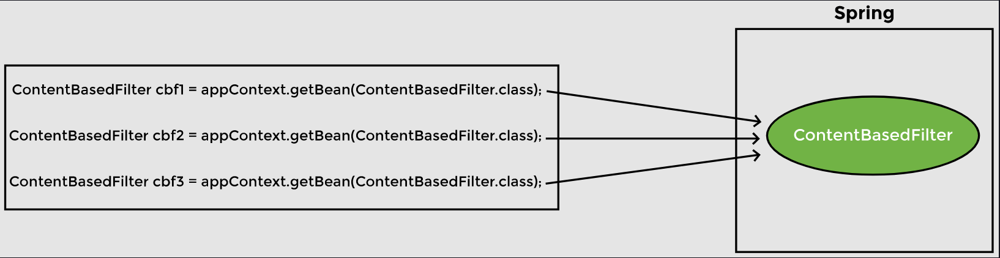
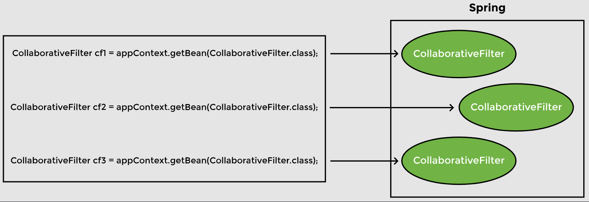

# Lesson 8: Bean Scope

## Overview

The Spring container manages beans. The term bean scope refers to the lifecycle and the visibility of beans. It tells how long the bean lives, how many instances of the bean are created, and how the bean is shared.



The singleton and prototype scopes can be used in any application while the last four scopes are only available for a web application.

## Demonstrated Concepts

### Singleton scope

The default scope of a bean is __singleton__, in which only one instance of the bean is created and cached in memory. Multiple requests for the bean return a shared reference to the same bean. In contrast, __prototype__ scope results in the creation of new beans whenever a request for the bean is made to the application context.

In our movie recommendation system example, we have two implementations of the Filter interface, namely ContentBasedFilter and CollaborativeFilter. We will use them to show the differences between singleton and prototype bean scope.

Application context manages the beans and we can retrieve a bean using the `getBean()` method. If we request the application context for the `ContentBasedFilter` bean three times as shown, we get the same bean:

```java
public static void main(String[] args) {
    //ApplicationContext manages the beans and dependencies
    ApplicationContext appContext = SpringApplication.run(
                                       MovieRecommenderSystemApplication.class, args);

    //Retrieve singleton bean from application context thrice
    ContentBasedFilter cbf1 = appContext.getBean(ContentBasedFilter.class); 
    ContentBasedFilter cbf2 = appContext.getBean(ContentBasedFilter.class); 
    ContentBasedFilter cbf3 = appContext.getBean(ContentBasedFilter.class); 
        
    System.out.println(cbf1);
    System.out.println(cbf2);
    System.out.println(cbf3);
}
```

As can be verified from the output, all beans are the same. The application context did not create a new bean when we requested it the second and third time. Rather, it returned the reference to the bean already created.



Singleton bean scope is the default scope. It is used to minimize the number of objects created. Beans are created when the context is loaded and cached in memory. All requests for a bean are returned with the same memory address. This type of scope is best suited for cases where stateless beans are required. On the contrary, prototype bean scope is used when we need to maintain the state of the beans.

### Prototype scope

In order to change the scope of the `CollaborativeFilter` bean from singleton to prototype, we will use the @Scope annotation and import org.springframework.context.annotation.Scope. We can specify the scope in the two ways shown below. Option 2 is the preferred approach.

```java
//Option 1
@Scope("prototype")

//Option 2 
@Scope(ConfigurableBeanFactory.SCOPE_PROTOTYPE)
```

We will then ask the application context for the `CollaborativeFilter` bean three times and output the results as follows:

```java
public static void main(String[] args) {
    //ApplicationContext manages the beans and dependencies
    ApplicationContext appContext = SpringApplication.run(
                                    MovieRecommenderSystemApplication.class, args);

    //...

    //Retrieve prototype bean from application context thrice
    CollaborativeFilter cf1 = appContext.getBean(CollaborativeFilter.class);    
    CollaborativeFilter cf2 = appContext.getBean(CollaborativeFilter.class);    
    CollaborativeFilter cf3 = appContext.getBean(CollaborativeFilter.class);
    
    System.out.println(cf1);
    System.out.println(cf2);
    System.out.println(cf3);
}
```

This time the application context will return three different objects. It will create a new object every time we invoke the `getBean()` method.



Spring creates a singleton bean even before we ask for it while a prototype bean is not created till we request Spring for the bean. We will print a message in the `ContentBasedFilter` and `CollaborativeFilter` constructors and comment everything in the `main` method. When the application is run, the output shows that Spring has created a `ContentBasedFilter` bean but the `CollaborativeFilter` bean has not yet been created.

If the code creating multiple objects of both classes is un-commented, it will be seen that the singleton bean constructor is called only once while the prototype bean constructor is called three times.

### Spring vs. Gang of Four singleton

There is a difference between the Spring singleton and the Gang of Four (GoF) singleton design patterns. The singleton design pattern as specified by the GoF means one bean per JVM. However, in Spring it means one bean per application context. By the GoF definition, even if there were more than one application contexts running on the same JVM, there would still be only one instance of the singleton class.