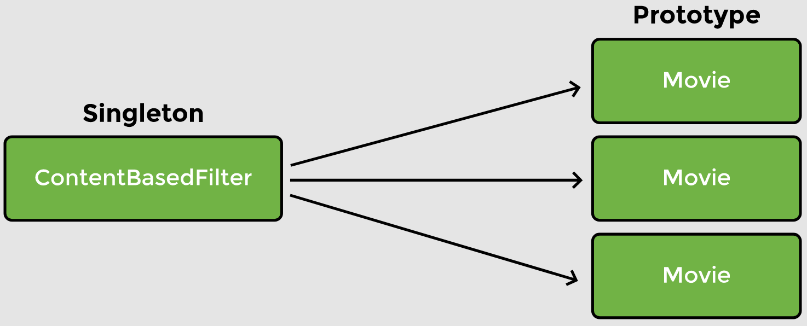
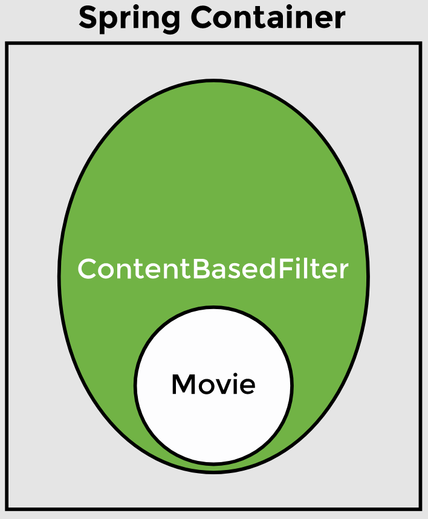
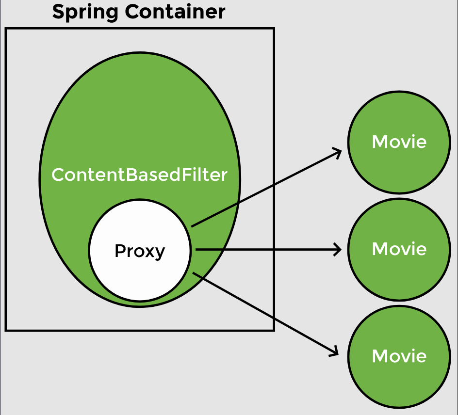

# Lesson 9: Mixing Bean Scope

## Demonstrated Concepts

### Singleton bean with prototype dependency

Sometimes, a bean has singleton scope but its dependency has prototype scope. For example, the content-based filter which recommends movies based on item-to-item similarity. Our basic implementation of the content-based filter compares different movies and assigns a similarity score. Hence, `Movie` is a dependency of the `ContentBasedFilter` class.

The `ContentBasedFilter` bean has singleton scope because we need only one instance of the filter. However, the `Movie` bean has prototype scope because we need more than one objects of this class.



The new class `Movie` has the prototype scope because we want multiple objects of it in the `ContentBasedFilter` class.

We modify the `ContentBasedFilter` class to create a variable `instances` for keeping track of the number of objects created. We also create a dependency on the `Movie` class using the `@Autowired` annotation. Lastly, we add a getter method for the dependency (`getMovie`) as shown below:

```java
@Component
public class ContentBasedFilter 
implements Filter {
    //for keeping track of instances created
    private static int instances= 0;
 
    @Autowired
    private Movie movie;

    public ContentBasedFilter() {
        instances++;      
        System.out.println("ContentBasedFilter constructor called");
    }

    public Movie getMovie() {
        return movie;
    }

    public static int getInstances(){
        return ContentBasedFilter.instances;
    }
}
```

In the `main` method of the `MovieRecommenderSystemApplication` class, we will get the `ContentBasedFilter` bean from the application context and then use it to retrieve the `Movie` bean thrice.

```java
public static void main(String[] args) {
    ApplicationContext appContext = SpringApplication.run(
                                          MovieRecommenderSystemApplication.class, args);

    //Retrieve singleton bean from application context
    ContentBasedFilter filter = appContext.getBean(ContentBasedFilter.class);   
    System.out.println("\nContentBasedFilter bean with singleton scope");
    System.out.println(filter);
    
    //Retrieve prototype bean from the singleton bean thrice
    Movie movie1 = filter.getMovie();   
    Movie movie2 = filter.getMovie();   
    Movie movie3 = filter.getMovie();
    
    System.out.println("\nMovie bean with prototype scope");
    System.out.println(movie1);
    System.out.println(movie2);
    System.out.println(movie3);

    //Print number of instances of each bean
    System.out.println("\nContentBasedFilter instances created: "+
                                                       ContentBasedFilter.getInstances());
    System.out.println("Movie instances created: "+ Movie.getInstances());
}
```

We would expect one instance of `ContentBasedFilter` bean and three instances of the prototype `Movie` bean. However, just one `ContentBasedFilter` instance and one `Movie` instance are created. This means the same `Movie` bean is returned every time. Moreover, the number of instances of the prototype bean created is one instead of three. Since a singleton bean is created when the context is loaded, the `Movie` constructor was called by Spring when it was creating the `ContentBasedFilter` bean. The prototype bean is injected into the singleton bean at the time of creation of the singleton bean when the container initializes it. This explains the following messages in the output:

_ContentBasedFilter constructor called_

_Movie constructor called_

> _When a prototype bean is injected into a singleton bean, it loses its prototype behavior and acts as a singleton._

The same instance of the bean is returned by the application context every time it is requested using the `getMovie` method.



### Proxy

Right now, Spring cannot inject the prototype bean into the singleton bean after it has been created. This problem can be solved in a number of ways. One of them is by using a __proxy__. We declare the bean with prototype scope as a proxy using the `proxyMode` element inside the `@Scope` annotation.

```java
@Scope(value=ConfigurableBeanFactory.SCOPE_PROTOTYPE, proxyMode=ScopedProxyMode.TARGET_CLASS)
```

The prototype bean doesn’t get autowired into the singleton bean at the time of its creation. Instead, a proxy or placeholder object is autowired. The proxy adds a level of indirection. When the developer requests the prototype bean from Spring, a new instance of the prototype bean is created and is returned by the application context. The proxy mode allows Spring container to inject a new object into the singleton bean.



After making this change in the code, we get a new `Movie` bean whenever the `ContentBasedFilter` bean calls the `getMovie()` method.

When you run the code, you will see that the singleton bean constructor is called when the `ContentBasedFilter` object is initialized, but the `Movie` constructor isn’t called at that time. The `Movie` constructor is called whenever the `getMovie()` method is called.

### `@Lookup`

Another method is by using the `@Lookup` annotation on the `getMovie()` method. This annotation tells Spring to return an instance of `Movie` type. It is essentially the same as `beanFactory.getBean(Movie.class)`.

One thing to consider is that singleton scope minimizes the number of objects created so the scope should only be changed where necessary. If there are more objects, there will be an impact on the memory used as well as on garbage collection.